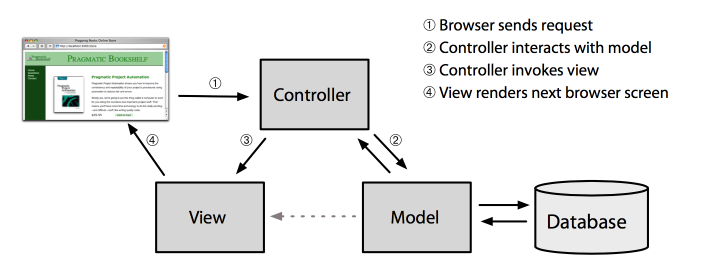

# Agile Web Development Rails 5 Note

## Part 1 - Getting Started

### 1. Installing Rails

#### macOS

方法1：先安装 brew，再用 brew install ruby，再用 gem 安装 rails

方法2：先安装 rbenv 或 rvm，再用 rbenv 或 rvm 安装 ruby，再用 gem 安装 rails

    $ gem install rails --version=5.0.0.1 --no-ri --no-rdoc
 
- 要掌握 rvm 或 rbenv 的使用
- 掌握 gem 的使用
- 掌握 bundler 的使用

#### 选择特定的 rails 版本

    $ gem list --local rails
    $ rails _5.0.0.1 --version

### 2. Instant Gratification

    $ bin/rails about
    // or
    $ bundle exec rails about

As you can see from the `bin/` prefix, this is running the rails command from the bin directory. This command is a wrapper, or *binstub*, for the Rails executable.

这里有讲到，在 development 下，修改的代码会立即生效，但是有额外的性能损失，因此在 production 下这个特性默认是关闭的。(原来如此，解答了我之前的一个疑惑，之前我在服务器上直接改代码后，代码并没有生效)

在 view 中显示动态内容的两种方法，以当前时间为例：

1. 在 view 中直接调用 `<%= Time.now %>`
2. 在 controller 中获得时间，赋值给实例变量，在 view 中显示此实例变量的值
       
       // controller
       @time = Time.now
       
       // view
       <%= @time %>

第二种方法的好处是更灵活一些，也是推荐的做法，但方法一也可以用于简单粗暴的实现。

#### Linking Page

尽量不要在 view 中 hardcode 一个链接，像这样：

    <a href="/say/hello">Hello</a>

而是使用 helper 为我们提供的 `link_to` 函数来动态生成链接：

    <%= link_to "Hello", say_hello_path %>
    
helper 函数一般用在 view 模板中，用来帮我们动态生成 html。比如 `link_to` 方法，我能想象它的简略实现：

    def link_to(content, link)
      "<a href=#{link}">#{content}</a>"
    end

`say_hello_path`，这是 rails 自动为路由生成的链接名，对应 'say/hello' 路由。

### 3. The Architecture of Rails Applications

#### MVC

> The *model* is responsible for maintaining the state of the application. Some- times this state is transient, lasting for just a couple of interactions with the user. Sometimes the state is permanent and is stored outside the application, often in a database.

> A *model* is more than data; it enforces all the business rules that apply to that data. For example, if a discount shouldn’t be applied to orders of less than $20, the model enforces the constraint. This makes sense; by putting the implementation of these business rules in the model, we make sure that nothing else in the application can make our data invalid. **The model acts as both a gatekeeper and a data store**.

model 不仅仅是数据，还包括对数据的一些处理，加工。

> The view is responsible for generating a user interface, normally based on data in the model. For example, an online store has a list of products to be displayed on a catalog screen. This list is accessible via the model, but it’s a view that formats the list for the end user. Although the view might present the user with various ways of inputting data, the view itself never handles incoming data. The view’s work is done once the data is displayed. There may well be many views that access the same model data, often for different purposes. The online store has a view that displays product information on a catalog page, and another set of views used by administrators to add and edit products.

view 负责输入 (??) 和输出，展示 model，面向终端用户。

> Controllers orchestrate the application. Controllers receive events from the outside world (normally, user input), interact with the model, and display an appropriate view to the user.

从上面这段描述来看，controller 还负责接受输入，而 view 而只负责展示??

(我可不可以这么理解，view 其实是算作输入源，它接受到输入后，并不作任何处理，而是交给 controller 来处理输入。view 接受输入，controller 处理输入)

其实对于 rails 的 MVC 来说，上面英文的描述其实也没错，因为在 rails 的 MVC 中，controller 是占主导，controller 的输入源来自 url，路由，跟 view 确实没有多少联系。controller 主要是接受这些路由输入，然后操作 model，然后输出到 view。

关于 view 上的按钮点击之类的啊，这类的交互是属于客户端的 mvc 范畴，而不是服务端。为什么 web 诞生的时候，html 没有 button 之类的，所有的可点击的都是 `<a>`，因为这时候还没有网页客户端的概念。这些 `<a>` 产生链接，点击后作为路由传递给服务器的 controller。

(我上次说 rails 的 MVC 其实更像 MVP，其实错了，MVP 里，M 和 V 是完全没有联系的，而 rails 的 MVC 里，你是可以在 view 的模板里访问 model 的)

> The controller supplies data to the view, and the controller receives events from the pages generated by the views.

#### Active Record

ORM

#### Action Pack: Then View and Controller

> When you think about it, the view and controller parts of MVC are pretty intimate. The controller supplies data to the view, and the controller receives events from the pages generated by the views. Because of these interactions, support for views and controllers in Rails is bundled into a single component, Action Pack.

View: ERB 模板

Controller: 中心，很多职责，响应路由，管理缓存，管理 helper 模块 (扩展 html 模板)，管理 session

### 4. Introduction to Ruby

Ruby is OO Language.

Ruby 的命名规范：

- 方法名，全小写字母，用 `_` 线分隔多个单词，成员变量用 `@` 加上小写字母；
- 类名，module 名，大写字母开头，双峰写法；
- symbol，符号，`:` 开头。

#### Data Types

- String: `''` 表示 raw string，连 `\n` 都不转义，`""` 会转义，而且支持插值
- Array & Hash
- 正则：/pattern/，str =~ /pattern/

#### Logic

control flow: if / while

blocks and iterators：

block 有 2 种形式，一种是用于单行的 `{}`，一种是用于多行的 `do...end`

在方法中用 yield 来调用传递进来的 block，并且可以在 yield 后面加上变量，从而给 block 传参。

    def wrap &b
        3.times(&b)
    end
    wrap { puts "Hi!" }

在参数中加上 `&` 表示命名的 block。

一个方法只能有一个 block，且这个 block 必须作为最后一个参数。

我觉得可以简单地把 block 理解成一种匿名回调函数。

block 经常和 iterator 一起使用。

Exception：

begin...rescue...end
raise

#### Organizing Structure

class 和 module

**class**

- 实例方法和类方法；
- 实例变量，访问器 (`attr_accessor` ...)

**module**

可以理解成一种带实现的接口，一种 minix。

module 有 2 个作用：

1. 作为 namespace ，防止命名冲突
1. 共享方法，module 里的所有 class 都可以共享此 module 中的所有方法，而不用继承自此 module；另外，class 也可以包含 module，然后使用 module 中的方法。一种 minix 的思想。而不是像 java 这种去实现一种接口的思想。方法注入? 方法扩展?

#### Ruby Idioms

1. empty! empty?
1. a||b, a||=b
1. lambda 操作符 ->，把 block 变成 Proc 的对象 (block, lambda, proc)

----

## Part 2 -- Building an Application

### 5. The Depot Application

介绍了我们要练习的项目：一个简单版的购物网站。

初步的流程：

1. Use Cases：允许买者在这个网站上购物，允许卖者在这上面管理商品及订单
1. Page Flow：简单的用户交互流程
1. Data：需要哪些数据

### 6. Task A：Creating the Application

